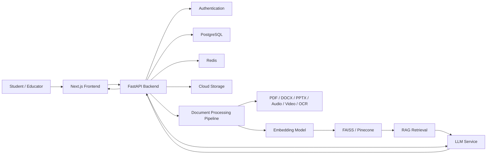

# EduMind AI - Project Blueprint

## 1. Project Title

EduMind AI - Intelligent AI-Powered Learning Management Platform

## 2. Abstract

EduMind AI is an AI-powered learning platform that transforms educational content into personalized and interactive study resources. It allows users to upload PDFs, PowerPoint files, Word documents, lecture recordings, videos, and YouTube links. Using Artificial Intelligence and Natural Language Processing, the system automatically generates structured notes, concise summaries, flashcards, quizzes, mind maps, and AI-powered podcasts.

The platform includes an AI Tutor that answers questions from uploaded materials using Retrieval-Augmented Generation. This helps produce accurate, context-aware responses grounded in the student's own study content. EduMind AI also includes analytics, study streaks, quiz performance tracking, personalized recommendations, study planning, exam preparation tools, assignment generation, transcription, multilingual translation, and image-based doubt solving.

EduMind AI is designed as a scalable full-stack application using modern web technologies, AI services, cloud storage, vector databases, OCR, speech recognition, and interactive user interfaces.

## 3. Problem Statement

Students often spend a large amount of time organizing notes, summarizing content, preparing quizzes, revising lectures, and searching for answers across scattered learning materials. Existing learning platforms usually provide storage or course delivery, but they do not deeply personalize the learning process around each student's own uploaded content.

EduMind AI solves this by converting raw educational material into structured, interactive, and personalized learning resources.

## 4. Objectives

- Allow students to upload and manage multiple types of learning content.
- Automatically generate notes, summaries, flashcards, quizzes, mind maps, and podcasts.
- Provide a RAG-based AI Tutor that answers questions using uploaded materials.
- Track learning progress, quiz performance, study streaks, and recommendations.
- Support exam preparation, study planning, reminders, assignments, transcription, OCR, and translation.
- Deliver a clean and scalable full-stack architecture suitable for real deployment.

## 5. Target Users

- Students
- College learners
- Competitive exam aspirants
- Educators
- Self-learners
- Online course creators

## 6. Core Modules

### User Authentication and Profile Management

Users can register, log in, manage profiles, select learning goals, and configure preferences such as language, study schedule, and exam targets.

### AI Study Dashboard

The dashboard displays recent uploads, generated resources, pending study tasks, quiz performance, recommendations, and study streaks.

### Document Upload and Processing

The upload system accepts PDFs, slides, Word documents, lecture recordings, videos, and YouTube links. Content is extracted, cleaned, chunked, embedded, and stored for AI usage.

### AI Notes Generator

The notes generator converts uploaded materials into structured notes with headings, definitions, key points, examples, formulas, and revision highlights.

### AI Tutor

The AI Tutor uses Retrieval-Augmented Generation to answer questions based on the uploaded content. It retrieves relevant document chunks from a vector database and sends them to the language model with the user's question.

### Flashcard Generator

The system creates question-answer flashcards for active recall and spaced repetition.

### Quiz Generator

The quiz module creates multiple-choice, short-answer, and true-or-false questions from study materials. It tracks scores and explains answers.

### AI Podcast Generator

The podcast generator converts notes or summaries into a conversational audio lesson using text-to-speech services.

### Lecture Transcription

Audio and video lectures are transcribed into text using speech-to-text models such as Whisper.

### Study Planner and Calendar

Students can create study plans, set deadlines, schedule revisions, and receive reminders.

### Progress Analytics Dashboard

The analytics dashboard tracks study time, completed materials, quiz performance, weak topics, streaks, and productivity trends.

### Assignment Generator

The assignment generator creates practice questions, project tasks, answer outlines, and rubrics from uploaded content.

### Mind Map Generator

The mind map module creates visual concept maps from topics, chapters, or uploaded documents.

### AI Image-Based Doubt Solver

Students can upload a photo of a question or diagram. OCR extracts the text, and the AI explains the answer step by step.

### Multilingual Translation

Generated study content can be translated into different languages.

### Notifications and Reminders

Users receive reminders for scheduled study sessions, pending quizzes, exam countdowns, and revision tasks.

## 7. Recommended Architecture

## 8. High-Level Data Flow

1. User uploads learning material.
2. Backend stores the original file in cloud storage.
3. Processing service extracts text, transcript, or OCR content.
4. Extracted content is cleaned and split into chunks.
5. Chunks are embedded and stored in a vector database.
6. AI modules use the content to generate notes, summaries, quizzes, flashcards, and mind maps.
7. AI Tutor retrieves relevant chunks and answers user questions with source-grounded context.
8. Analytics services track usage, performance, and study progress.

## 9. Suggested Database Entities

- users
- profiles
- courses
- materials
- material_chunks
- generated_notes
- summaries
- flashcards
- quizzes
- quiz_questions
- quiz_attempts
- tutor_conversations
- tutor_messages
- study_plans
- study_tasks
- analytics_events
- notifications
- assignments
- mind_maps
- podcasts
- transcriptions

## 10. API Groups

- `/auth`
- `/users`
- `/materials`
- `/processing`
- `/notes`
- `/summaries`
- `/flashcards`
- `/quizzes`
- `/tutor`
- `/planner`
- `/analytics`
- `/assignments`
- `/mindmaps`
- `/podcasts`
- `/transcriptions`
- `/ocr`
- `/translate`
- `/notifications`

## 11. Development Phases

### Phase 1 - Foundation

- Create project documentation.
- Define architecture.
- Set up frontend and backend folders.
- Create environment configuration examples.
- Add basic README and run instructions.

### Phase 2 - Frontend Prototype

- Build dashboard layout.
- Add upload screen.
- Add notes, flashcards, quizzes, tutor, planner, and analytics pages.
- Use mock data first so the UI is usable before backend integration.

### Phase 3 - Backend API

- Set up FastAPI.
- Add database models.
- Add upload APIs.
- Add generated resource APIs.
- Add tutor chat APIs.

### Phase 4 - AI Pipeline

- Add text extraction.
- Add embeddings and vector search.
- Add RAG question answering.
- Add summary, notes, quiz, flashcard, and mind map generation.

### Phase 5 - Advanced Learning Features

- Add transcription.
- Add OCR doubt solver.
- Add translation.
- Add podcast generation.
- Add study planner and reminders.

### Phase 6 - Production Readiness

- Add authentication.
- Add cloud storage.
- Add tests.
- Add Docker setup.
- Add CI/CD.
- Prepare deployment documentation.

## 12. First Milestone

The first milestone is to create a working web app prototype with:

- Dashboard
- Upload page
- AI Tutor interface
- Notes generator page
- Flashcards page
- Quiz page
- Study planner page
- Analytics page

The first version can use mock data while the backend and AI services are added.
